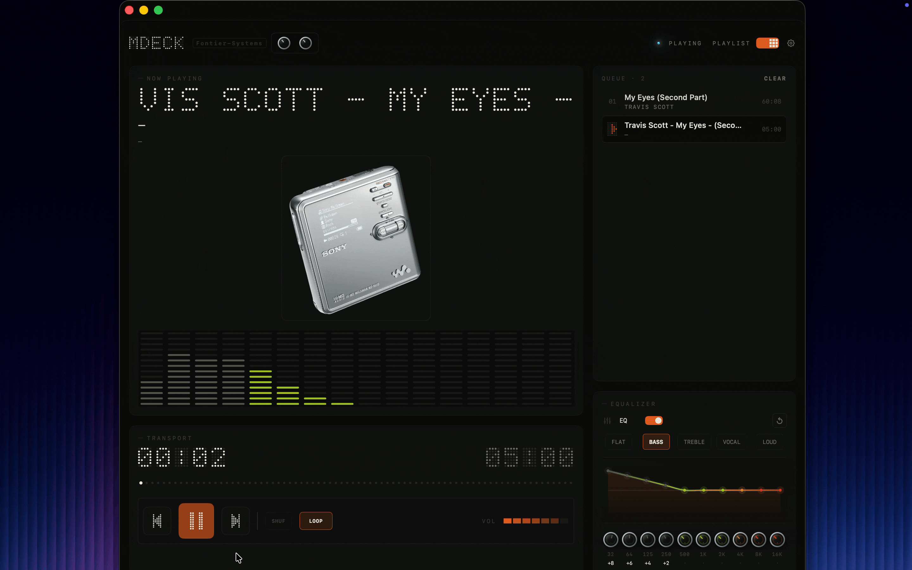

<div align="center">

# MDECK

</div>

<div align="center">


---

**A native macOS MP3/WAV/FLAC player with a retro MiniDisc-inspired aesthetic.** 

</div>

<div align="center">
    
</div>


## New Features:

- Persistent playlists
- Artwork support
- More color themes


## Demos

<div align="center">


</div>

## Requirements

- macOS 14.0+
- Xcode 16+ (Swift 5)
- [XcodeGen](https://github.com/yonatankra/xcodegen) (`brew install xcodegen`) to generate
  the project

## Build & run

```bash
xcodegen generate
open MDECK.xcodeproj   # then ⌘R in Xcode
```

Or from the command line:

```bash
xcodegen generate
xcodebuild -project MDECK.xcodeproj -scheme MDECK -configuration Debug build
```

## Usage

- **Add music** — drag audio files into the window, or use **File → Open Files…** (⌘O).
- Supported formats: MP3, M4A, AAC, WAV, AIFF, FLAC.

Note: *MDECK is a fork of [DotMP3](https://github.com/moerdowo/DotMP3)*

## License

MIT
